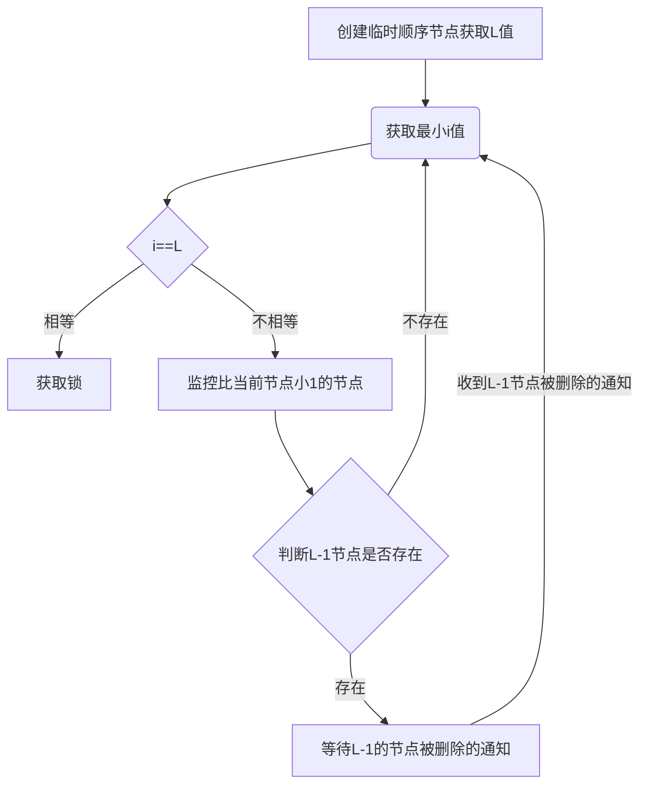

# zk-lock
[toc]

# 锁
**进程内的线程并发，JVM锁(JDK的锁)就能解决**


**为什么需要锁？**
* 多任务环境中才需要
* 任务都需要对统一共享资源进行写操作
* 对资源的访问是互斥的
现在的项目都是微服务架构，多个服务部署在不同节点，继而会有多个进程，或者说是多个线程，而多个线程对同一资源进行写操作就会产生资源竞争，并且这些线程所需要执行的任务且都是互斥（我在这条数据，你也在该，程序不能达到它想要的目的）。就需要分布式锁

加上锁之后的写操作流程：
> 任务通过竞争获取锁，才能对资源进行写操作，当其中一个任务占有锁的时候，其它任务时阻塞状态，直到任务完成释放锁。然后周而复始。


## JUC包下的Lock锁


```java
package com.alag.concurrent.lock;


import java.util.concurrent.locks.Lock;
import java.util.concurrent.locks.ReentrantLock;

public class Test1 {
    private Integer count = 100;

    private Lock lock = new ReentrantLock();

    public static void main(String[] args) {
        new Test1().start();
    }

    private void start() {
        TicketTask task = new TicketTask();

        Thread t1 = new Thread(task,"t1");
        Thread t2 = new Thread(task,"t2");
        Thread t3 = new Thread(task,"t3");
        Thread t4 = new Thread(task,"t4");

        t1.start();
        t2.start();
        t3.start();
        t4.start();
    }
    public class TicketTask implements Runnable {
        public void run() {
                while (count > 0) {
                    lock.lock();
                    try {
                        if (count > 0) {
                            System.out.println(Thread.currentThread().getName()+"-------"+"序号："+count-- +"被卖出");
                        }
                    } catch (Exception e) {
                    }finally {
                        lock.unlock();
                    }
            }
        }
    }
}

```
### Lock和synchronized的区别
**更加灵活**


| 方法 | 作用 |
| --- | --- |
| lock | 阻塞式加锁，直到锁被加上,相当于synchronized |
| lockInterruptibly | 可中断式加锁 |
| tryLock | 尝试加锁,尝试一次不行就算 |
| tryLock(long time, TimeUnit unit) | 在一段时间内尝试加锁 |

## 分布式锁

| 方案 | 实现思路 | 优点 | 缺点 |
| --- | --- | --- | --- |
| 利用mysql的实现方案 | 利用数据库自身提供的所机制实现，要求数据库支持行级锁 | 实现简单，稳定可靠 | 300~700左右的并发，性能差，无法满足高平发场景；容易出现死锁现象（在解锁之前突然宕机），无法优雅实现阻塞式锁（被动式加锁，其它线程解锁后没有主动通知） |
| 利用redis的实现方案 | 使用setNX和LUA脚本实现，保证对缓存操作序列的原子性 | 性能好（基于内存，数据库基于IO） | 实现相对复杂，又出现死锁的可能性，无法优雅实现阻塞式锁 |
| 利用zookeeper的实现方案 | 基于zk节点特性以及watch机制实现 | 性能好，稳定可靠性高，较好的实现阻塞式锁 | 实现相对复杂 |
### mysql数据库锁
#### 数据库
```sql
CREATE TABLE `mysql_lock` (
  `id` int(1) NOT NULL AUTO_INCREMENT,
  PRIMARY KEY (`id`)
) ENGINE=InnoDB AUTO_INCREMENT=2 DEFAULT CHARSET=utf8;
```

```yml
spring:
  datasource:
    # 使用阿里的Druid连接池
    type: com.alibaba.druid.pool.DruidDataSource
    driver-class-name: com.mysql.jdbc.Driver
    # 填写你数据库的url、登录名、密码和数据库名
    url: jdbc:mysql://127.0.0.1:3306/lock?useSSL=false&characterEncoding=utf8
    username: root
    password: 123456
    ###数据源的其他配置
    initialSize: 5
    minIdle: 5
    maxActive: 20
    maxWait: 60000
    timeBetweenEvictionRunsMillis: 60000
    minEvictableIdleTimeMillis: 300000
    validationQuery: SELECT 1 FROM DUAL
    testWhileIdle: true
    testOnBorrow: false
    testOnReturn: false
    poolPreparedStatements: true
    ### 配置监控统计拦截的filters，去掉后监控界面sql无法统计，'wall'用于防火墙
    filters: stat,wall
    maxPoolPreparedStatementPerConnectionSize: 20
    useGlobalDataSourceStat: true
    connectionProperties: druid.stat.mergeSql=true;druid.stat.slowSqlMillis=500
```

#### 测试类
```java
package com.alag.lock;

import lombok.extern.slf4j.Slf4j;
import org.springframework.stereotype.Component;

import javax.annotation.Resource;
import java.util.concurrent.locks.Lock;

@Slf4j
@Component
public class Test1 {
    private Integer count = 100;
    @Resource
    private Lock lock;

    public void start() {
        TicketThread ticketThread = new TicketThread();

        Thread t1 = new Thread(ticketThread, "t1");
        Thread t2 = new Thread(ticketThread, "t2");
        Thread t3 = new Thread(ticketThread, "t3");
        Thread t4 = new Thread(ticketThread, "t4");

        t1.start();
        t2.start();
        t3.start();
        t4.start();
    }

    public class TicketThread implements Runnable {
        @Override
        public void run() {
            while (count > 0) {
                lock.lock();
                try {
                    if (count > 0) {
                        System.out.println(Thread.currentThread().getName() + "----抢到票编号:" + count--);
                    }
                } catch (Exception e) {
                    log.info(e.getMessage());
                }finally {
                    lock.unlock();
                }
            }
        }
    }

}

```

#### 实现lock类
```java
package com.alag.lock;

import com.alag.lock.mapper.LockMapper;
import lombok.extern.slf4j.Slf4j;
import org.springframework.beans.factory.annotation.Autowired;
import org.springframework.stereotype.Service;

import javax.annotation.Resource;
import java.util.concurrent.TimeUnit;
import java.util.concurrent.locks.Condition;
import java.util.concurrent.locks.Lock;

@Service
@Slf4j
public class MysqlLock implements Lock {
    @Autowired
    private LockMapper lockMapper;

    @Override
    public void lock() {
        //尝试加锁
        if (tryLock()) {
            return;
        }
        //等待
        waitForLock();
        //递归调用
        lock();
    }

    private void waitForLock() {
        try {
            Thread.currentThread().sleep(10);
        } catch (InterruptedException e) {
            e.printStackTrace();
        }
    }

    @Override
    public void lockInterruptibly() throws InterruptedException {}

    @Override
    public boolean tryLock() {
        try {
            lockMapper.insert(1);
        } catch (Exception e) {
            return false;
        }
        return true;
    }

    @Override
    public boolean tryLock(long time, TimeUnit unit) throws InterruptedException {
        return false;
    }

    @Override
    public void unlock() {
        lockMapper.deleteByPrimarykey(1);
    }

    @Override
    public Condition newCondition() {
        return null;
    }
}

```
#### mapper
```java
package com.alag.lock.mapper;


import org.apache.ibatis.annotations.Delete;
import org.apache.ibatis.annotations.Insert;
import org.apache.ibatis.annotations.Mapper;
import org.apache.ibatis.annotations.Param;

@Mapper
public interface LockMapper {

    @Insert("insert into mysql_lock values(#{id})")
    int deleteByPrimarykey(@Param("id") int id);
    @Delete("delete from mysql_lock where id = #{id}")
    int insert(@Param("id") int id);

}

```
#### 启动类
```java
package com.alag.lock;

import org.springframework.beans.factory.annotation.Autowired;
import org.springframework.boot.CommandLineRunner;
import org.springframework.boot.SpringApplication;
import org.springframework.boot.autoconfigure.SpringBootApplication;

@SpringBootApplication
public class MysqlLockApplication implements CommandLineRunner {
    @Autowired
    private Test1 test1;
    public static void main(String[] args) {

        SpringApplication.run(MysqlLockApplication.class);
    }

    @Override
    public void run(String... args) throws Exception {
        test1.start();
    }
}

```
### Zookeeper分布式锁
#### 介绍
zookeeper是一个开放源码的分布式协调服务，是将那些复杂且容易出错的分布式一致性服务封装起来，并为其提供简单易用的接口提供给用户

#### 特性

1. zk会在内存中维护一个具有层次关系的数据结构，它非常类似于一个标准的文件系统
2. 数据结构中每一个**数据节点**都可以存储信息，还有各种属性信息，数据节点的类型有**持久节点**，**临时节点**，**持久顺序节点**，**临时顺序节点**，其中**临时顺序节点**是实现分布式锁的基础
3. 事件监听器（watcher），可以在节点注册watcher，当节点发生特定变化时，会通知感兴趣的客户端

##### watcher机制
```java 
package com.alag.zoo;

import org.I0Itec.zkclient.IZkDataListener;
import org.I0Itec.zkclient.ZkClient;
import org.I0Itec.zkclient.serialize.SerializableSerializer;
import org.junit.Test;

public class ZooTest {
    public static final String ZOOKEEPER_IP_PORT = "192.168.0.102:2181";
    private ZkClient zkClient = new ZkClient(ZOOKEEPER_IP_PORT, 1000, 1000, new SerializableSerializer());

    @Test
    public void watcherTest() throws InterruptedException {
//        创建一个持久节点
        String path = "/watcher";
        zkClient.createPersistent(path);

//        实例化一个监听器
        IZkDataListener listener = new IZkDataListener() {
            public void handleDataChange(String s, Object o) throws Exception {
            }

            public void handleDataDeleted(String s) throws Exception {
                System.out.println("收到节点被删除事件");
            }
        };
        this.zkClient.subscribeDataChanges(path,listener);
        Thread.currentThread().join();
    }
}

```


#### zk分布式锁实现流程图


#### 代码实现
ZkLock
```java
package com.alag.zk.lock;

import lombok.extern.slf4j.Slf4j;
import org.I0Itec.zkclient.IZkDataListener;
import org.I0Itec.zkclient.ZkClient;
import org.I0Itec.zkclient.serialize.SerializableSerializer;
import org.springframework.stereotype.Component;

import java.util.Collections;
import java.util.List;
import java.util.concurrent.CountDownLatch;
import java.util.concurrent.TimeUnit;
import java.util.concurrent.locks.Condition;
import java.util.concurrent.locks.Lock;

@Component
@Slf4j
public class ZkLock implements Lock {
    private static final String LOCK_PATH = "/lock";
    private static final String ZOOKEEPER_IP_PORT = "192.168.0.102:2181";
    private ZkClient zkClient = new ZkClient(ZOOKEEPER_IP_PORT, 1000, 1000, new SerializableSerializer());
    private CountDownLatch countDownLatch;

    private String beforePath;
    private String currentPath;

//    判断有没有Lock没有就创建


    public ZkLock() {
        if (!zkClient.exists(LOCK_PATH)) {
            zkClient.createPersistent(LOCK_PATH);
        }
    }
//    阻塞式加锁
    @Override
    public void lock() {
        if (tryLock()) {
            return;
        }
        waitForLock();
        lock();
    }

    private void waitForLock() {
        IZkDataListener iZkDataListener = new IZkDataListener() {
            @Override
            public void handleDataDeleted(String s) throws Exception {
                log.info("已经捕获到节点被删除事件");
                if (countDownLatch != null) {
                    countDownLatch.countDown();
                }
            }

            @Override
            public void handleDataChange(String s, Object o) throws Exception {}
        };

        this.zkClient.subscribeDataChanges(beforePath,iZkDataListener);
        if (this.zkClient.exists(beforePath)) {
            countDownLatch = new CountDownLatch(1);
            try {
//                线程被阻塞之后当1-1==0才会放行，也就是节点被删除
                countDownLatch.await();
            } catch (InterruptedException e) {
                e.printStackTrace();
            }
        }
        this.zkClient.unsubscribeDataChanges(beforePath,iZkDataListener);
    }

    @Override
    public void lockInterruptibly() throws InterruptedException {

    }
//    非阻塞式加锁
    @Override
    public boolean tryLock() {
//        判断有没有加锁
        if (currentPath == null || currentPath.length() <= 0) {
//            没有就创建一个临时顺序节点,会获得一个自增长的字符串：0000000118
            currentPath = zkClient.createEphemeralSequential(LOCK_PATH + "/", "lock");
            log.info("当前节点:{}",currentPath);
        }
        List<String> children = this.zkClient.getChildren(LOCK_PATH);
        Collections.sort(children);

//        判断自己是不是第一个节点
        if (currentPath.equals(LOCK_PATH + "/" + children.get(0))) {
            return true;
        } else {
//            去掉前面的6位得到当前节点在List集合中的值，找到他在集合中的index
            int wz = Collections.binarySearch(children, currentPath.substring(6));
            beforePath = LOCK_PATH + "/" + children.get(wz - 1);
        }
        return false;
    }

    @Override
    public boolean tryLock(long time, TimeUnit unit) throws InterruptedException {
        return false;
    }

    @Override
    public void unlock() {
        this.zkClient.delete(currentPath);
        this.zkClient.close();
    }

    @Override
    public Condition newCondition() {
        return null;
    }
}

```

TicketSell
```java
package com.alag.zk;

import com.alag.zk.lock.ZkLock;
import lombok.extern.slf4j.Slf4j;
import org.springframework.stereotype.Component;

import java.util.concurrent.locks.Lock;

@Slf4j
@Component
public class TicketSell {

    private Integer count = 100;

    public void start() {
        TicketThread ticketThread = new TicketThread();

        Thread t1 = new Thread(ticketThread, "t1");
        Thread t2 = new Thread(ticketThread, "t2");
        Thread t3 = new Thread(ticketThread, "t3");
        Thread t4 = new Thread(ticketThread, "t4");

        t1.start();
        t2.start();
        t3.start();
        t4.start();
    }

    public class TicketThread implements Runnable {
        @Override
        public void run() {
            while (count > 0) {
                Lock lock = new ZkLock();
                lock.lock();
                try {
                    if (count > 0) {
                        System.out.println(Thread.currentThread().getName() + "----抢到票编号:" + count--);
                    }
                } catch (Exception e) {
                    log.info(e.getMessage());
                }finally {
                    lock.unlock();
                }
            }
        }
    }
}

```
```java
package com.alag.zk;

import org.springframework.beans.factory.annotation.Autowired;
import org.springframework.boot.CommandLineRunner;
import org.springframework.boot.SpringApplication;
import org.springframework.boot.autoconfigure.SpringBootApplication;

@SpringBootApplication
public class ZkLockApplication implements CommandLineRunner {
    @Autowired
    private TicketSell ticketSell;

    public static void main(String[] args) {
        SpringApplication.run(ZkLockApplication.class, args);
    }

    @Override
    public void run(String... args) throws Exception {
        ticketSell.start();
    }
}

```

### Redis分布式锁
#### Redis分布式锁的命令

| command | action |
| --- | --- |
| setnx | 不存在才会设值 |
| getset | 获取到才会设值 |
| expire | 有效期 |
| del | 删除 |


#### 流程图


#### CloseOrderTaskV3
```java
    @Scheduled(cron = "0 */1 * * * ?")
    public void closeOrderTaskV3() {
        Long lockTimeout = Long.valueOf(PropertiesUtil.getProperty("lock.timeout", "5000"));
        boolean result = redisService.setNX(Const.REDIS_LOCK.CLOSE_ORDER_TASK_LOCK, String.valueOf(System.currentTimeMillis()+lockTimeout));
        if (result) {
            log.info("锁已被抢到，执行业务");
            this.closeOrder(Const.REDIS_LOCK.CLOSE_ORDER_TASK_LOCK);
        } else {
            log.info("锁已被占用，尝试重置再次获取");
            Object objret =  redisService.get(Const.REDIS_LOCK.CLOSE_ORDER_TASK_LOCK);
            if (objret != null && System.currentTimeMillis() > Long.valueOf(objret.toString())) {
                byte[] ret = redisService.getSet(Const.REDIS_LOCK.CLOSE_ORDER_TASK_LOCK, String.valueOf(System.currentTimeMillis()+lockTimeout));
                //ret返回null的时候说明这个锁已经不存在，那么会直接set，获取锁

                if (ret == null || objret.toString().equals(new String(ret))) {
                    log.info("重置，获得锁");
                    closeOrder(Const.REDIS_LOCK.CLOSE_ORDER_TASK_LOCK);
                } else {

                    log.info("重置获取锁失败");
                }
            } else {
                log.info("时间未超时，获取失败");
            }
        }
        log.info("订单关闭任务结束");
    }
    private void closeOrder(String lockName) {
        redisService.expire(lockName, 50L);
        log.info("设置有效时间成功");
        log.info("开始关闭订单");
        int hour = Integer.parseInt(PropertiesUtil.getProperty("close.order.task.hour", "1"));
        orderService.closeOrder(hour);
        log.info("关闭订单结束");
        redisService.del(lockName);
        log.info("释放锁");
    }
```
